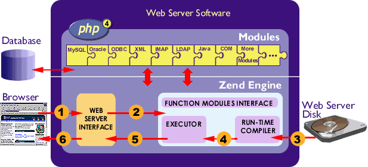
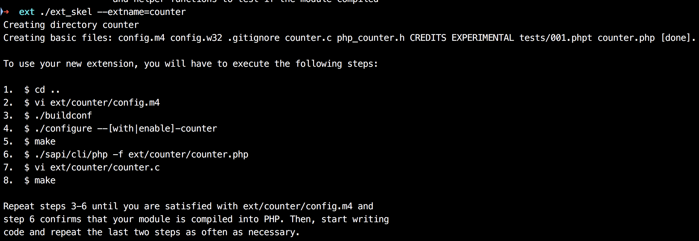
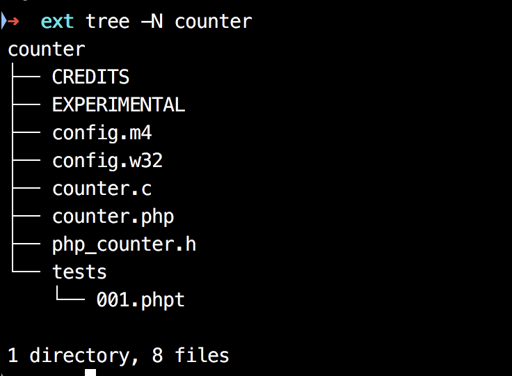

# php 扩展认识

## 参考

* [Zend 网站中的» Internals 章节](https://devzone.zend.com/303/extension-writing-part-i-introduction-to-php-and-zend/)
* [Zend API：深入 PHP 内核](http://php.net/manual/zh/internals2.ze1.zendapi.php)
* [TIPI 扩展入门](http://www.php-internals.com/book/?p=chapt11/11-02-00-extension-hello-world)
* [php internals](https://phpinternals.net/docs)

## 先看图




## 前期准备
* 编译纯净版 PHP
```
./buildconf
./configure --disable-all --enable-debug --prefix=$HOME/myphp
make && make install
```

* 拷贝配置文件 `cp ~/learn/php-7.2.8/php.ini-development /Users/panlong/myphp728/lib/php.ini`
* 官方自带工具 `ext_skel` 的使用
* 找到 php ext 扩展安装目录
    * `~/myphp728/bin/php -i|grep ext` （我的在 `/Users/panlong/myphp728/lib/php/extensions/debug-non-zts-20170718`）
* 官方手册建议：当开发 PHP 扩展时，强烈建议安装 autoconf 2.13 版，尽管用更新的版本可使用。2.13 版被认为是在 autoconf 中可用性，适用性及用户基础等方面最好的版本。使用最新版本有时会与所期望的 configure 输出在样式上有所不同。

## php 安装后的目录结构

### PHP 安装目录 `tree -N -L 2 ~/myphp728`

```
├── bin     //PHP 编译生成的二进制程序目录
│   ├── php     //cli 模式下的 PHP
│   ├── php-cgi
│   ├── php-config  // 获取 PHP 的安装信息，编译安装 PHP 时会用到
│   ├── phpdbg
│   └── phpize  //生成扩展的 configure 文件
├── include     //PHP 源码的头文件 如下
│   └── php
├── lib         //依赖的 so 库
│   ├── php
│   └── php.ini
├── php
│   └── man
└── var     //日志
    ├── log
    └── run
```

### PHP 安装目录下的 include 目录 `tree -N -L 3 ~/myphp728/lib`

```
├── php
│   ├── build       //编译时的工具、m4 配置等，编写扩展时会用到
│   │   ├── Makefile.global
│   │   ├── acinclude.m4        //PHP 自定义的 autoconf 宏
│   │   ├── ax_check_compile_flag.m4
│   │   ├── config.guess
│   │   ├── config.sub
│   │   ├── libtool.m4          //libtool 定义的 autoconf 宏，acinclude.m4、libtool.m4 会被合成 aclocal.m4
│   │   ├── ltmain.sh
│   │   ├── mkdep.awk
│   │   ├── phpize.m4           //PHP 核心 configure.in 配置（对 buildconf 的封装）
│   │   ├── run-tests.php
│   │   ├── scan_makefile_in.awk
│   │   └── shtool
│   └── extensions  //扩展 so 保存目录
│       └── debug-non-zts-20170718
└── php.ini
```
## 执行命令

* PHP 源码/ext 目录下的工具 ext_skel 
    * `ls ~/learn/php-7.2.8/ext`
    * 作用：生成扩展的基本骨架，帮助扩展开发快速生成一个`规范`的扩展结构
    * 使用：./ext_skel --extname=扩展名称

* 多版本 PHP 需要注意
    * **php-config 是一个简单的命令行脚本用于获取所安装的 PHP 配置的信息。**
    * **在编译扩展时，如果安装有多个 PHP 版本，可以在配置时用 --with-php-config 选项来指定使用哪一个版本编译，该选项指定了相对应的 php-config 脚本的路径。**
  
* 扩展的安装步骤
    1. 通过 ext_skel 脚本生成扩展的基本框架
    2. 修改 config.m4 配置：设置编译配置参数、设置扩展的源文件、依赖库依赖函数检查等
    3. 编写扩展要实现的功能：按照 PHP 扩展的格式以及 PHP 提供的 API 编写功能
    4. 生成 configure：扩展编写完成后，执行 phpize 脚本生成 configure 以及其他配置文件
    5. 编译 & 安装：`编译三步`（./configure 、 make 、 make install） 然后将扩展的 `.so` 文件添加到 php.ini 中

* 生成扩展脚手架 
    * `这里为了方便说明，跟官网一样，也假设扩展叫 counter`
    * ./ext_skel --extname=counter
    * 执行后如图 
    
    
    * 现在我们查看脚手架搭建的代码 
    
    

## 扩展组成

* 从图中，我们看到以下必须文件
    * config.m4 
        * UNIX 构建系统交互文件，autoconf 规则的编译配置文件
        * config.m4 文件使用 GNU autoconf 语法编写。简而言之，就是用强大的宏语言增强的 shell 脚本。注释用字符串 dnl 分隔，字符串则放在左右方括号中间（例如，[ 和 ]）。字符串可按需要多次嵌套引用。完整的语法参考可参见位于 » http://www.gnu.org/software/autoconf/manual/ 的 autoconf 手册。
        * `此处点开参考文档简单了解下m4文件`  [参考文档](http://php.net/manual/zh/internals2.buildsys.configunix.php)
        * 按惯例，**PHP_ARG_WITH()** 用于取得参数的选项，例如扩展所需库或程序的位置；而 **PHP_ARG_ENABLE()**  用于代表简单标志的选项。
    * config.w32 Windows 构建系统配置
    * php_counter.h 扩展头文件
    * counter.c 扩展源文件
    * couter.php 用于在 PHP 中测试扩展是否可用，可以不用
    * tests 目录 测试用例，执行 make test 时将执行、验证这些用例
* 将 PHP_ARG_WITH 和下面的 --with-counter 前的注释去掉 （即dnl）
* 要能够被编译，还需要去掉 --enable-counter 前的注释
* 在源代码**根目录**执行 `./buildconf --force`
* 在源代码**根目录**执行 `./configure --help | grep counter`

## config.m4 文件详解
* 例子：例子中的扩展名暂定为 `extname`

```
PHP_ARG_WITH(extname, for extname support,
[  --with-extname            Include extname support])
```

```
PHP_ARG_ENABLE(extname,
    [Whether to enable the "extname" extension],
    [  enable-extname        Enable "extname" extension support])
```

* `PHP_ARG_WITH 函数` 和 `PHP_ARG_ENABLE 函数` 
    * 第一个参数：扩展名（注意不用加引号）
    * 第二个参数：运行 `./configure` 脚本时显示的内容
    * 第三个参数：调用 `./configure --help` 时显示的帮助信息

```
if test $PHP_EXTNAME != "no"; then
    PHP_SUBST(EXTNAME_SHARED_LIBADD)
    PHP_NEW_EXTENSION(extname, extname.c, $ext_shared)
fi
```

* 当运行 `./configure --enable-extname` 的时候，即将 $PHP_EXTNAME 变量设置为 yes
* PHP_NEW_EXTENSION 函数（`PHP_NEW_EXTENSION(sample, sample.c sample2.c sample3.c, $ext_shared)`）
    * 第一个参数：扩展的名称
    * 第二个参数：需要的源文件名（空格分割）【如果我们的扩展使用了多个文件，便可以将这多个文件名罗列在函数的参数里】
    * 第三个参数：此扩展的编译形式
    * $ext_shared 参数用来声明这个扩展不是一个静态模块，而是在 PHP 运行时动态加载的

## hook 函数
* 之前小课曾经说过 PHP 的生命周期 `module startup -> request startup -> exec -> request shutdown -> module shutdown`

## simple 例子

* 在 php_counter.h 里添加行 PHP_FUNCTION(hi);
* 在 counter.c 里添加

```
const zend_function_entry mydemo_functions[] = {
	PHP_FE(confirm_mydemo_compiled,	NULL)		/* For testing, remove later. */
	PHP_FE(toDecodeSign, NULL) /* example decode sign from exists php code 这里是添加的代码*/
	PHP_FE_END	/* Must be the last line in mydemo_functions[] */
};

PHP_FUNCTION(hi) {
	php_printf("Hi !world");
}
```
## 扩展执行

* `~/myphp728/bin/phpize`
* `./configure --enable-counter --with-php-config=/Users/panlong/myphp728/bin/php-config`
* `make && make install`
* 将 `/Users/panlong/myphp728/lib/php/extensions/debug-non-zts-20170718/counter.so` 添加到 `php.ini` 中
    * 找到 ini 文件，添加 `extension=counter.so`
    * 验证：`~/myphp728/bin/php -m|grep counter`
   
* oneline : `phpize728 && ./configure --enable-mydemo --with-php-config=/Users/panlong/myphp728/bin/php-config && make && make install` 
## 测试结果

```
<?php
hi(); //输出：Hi world!

```


## 详细说明

### php_load_extension 函数

* ext/standard/dl.c 中定义的该函数 （可在 understand 中查看下该方法）


### `zend_module_entry` 结构体

```
/* {{{ mydemo_module_entry
 */
zend_module_entry mydemo_module_entry = {
	STANDARD_MODULE_HEADER,
	"mydemo",
	mydemo_functions,
	PHP_MINIT(mydemo),
	PHP_MSHUTDOWN(mydemo),
	PHP_RINIT(mydemo),		/* Replace with NULL if there's nothing to do at request start */
	PHP_RSHUTDOWN(mydemo),	/* Replace with NULL if there's nothing to do at request end */
	PHP_MINFO(mydemo),
	PHP_MYDEMO_VERSION,
	STANDARD_MODULE_PROPERTIES
};

```

* `ptype zend_module_entry`
```c
type = struct _zend_module_entry {
    unsigned short size;
    unsigned int zend_api;
    unsigned char zend_debug;
    unsigned char zts;
    const struct _zend_ini_entry *ini_entry;
    const struct _zend_module_dep *deps;
    const char *name;                                   //扩展名称
    const struct _zend_function_entry *functions;       //指向zend_functions_entry的指针
    int (*module_startup_func)(int, int);
    int (*module_shutdown_func)(int, int);
    int (*request_startup_func)(int, int);
    int (*request_shutdown_func)(int, int);
    void (*info_func)(zend_module_entry *);
    const char *version; 								//扩展的字符串版本号
    size_t globals_size;
    void *globals_ptr;
    void (*globals_ctor)(void *);
    void (*globals_dtor)(void *);
    int (*post_deactivate_func)(void);
    int module_started;
    unsigned char type;
    void *handle;
    int module_number;
    const char *build_id;
}
```

* `size,zend_api, zend_debug, zts`， 这四个类型通常用 `STANDARD_MODULE_HEADER` 填充
* **module_startup_func**

    > 模块初始化时被调用的函数指针。用来放一些初始化步骤。
    >
    > 初始化过程中出现故障返回 FAILURE，成功返回 SUCCESS。
    >
    > 声明一个初始化函数使用 ZEND_MINIT。

* **module_shutdown_func**

    > 模块被关闭时调用的函数指针，同来用来做一次性的析构步骤。如释放资源。
    > 成功返回SUCESS,失败返回FAILURE，未使用返回NULL。
    > 声明使用ZEND_MSHUTDOWN。

* **request_startup_func**

  > 每处理一次请求前调用此函数。
  >
  > 成功SUCESS，失败FAILURE，未使用返回NULL。
  >
  > 声明使用ZEND_RINIT。
  >
  > 从WEB来解释，就是每次请求调用此函数。

* **request_shutdown_func**

  > 每处理一次请求前后调用此函数。
  >
  > 成功SUCESS，失败FAILURE，未使用返回NULL。
  >
  > 声明使用ZEND_RINIT。

* **info_func**

  > 当调用phpinfo()时打印出的关于此扩展的信息。
  > 这个信息就是由此函数来输出的。
  > 声明使用ZEND_MINFO


（以上）

