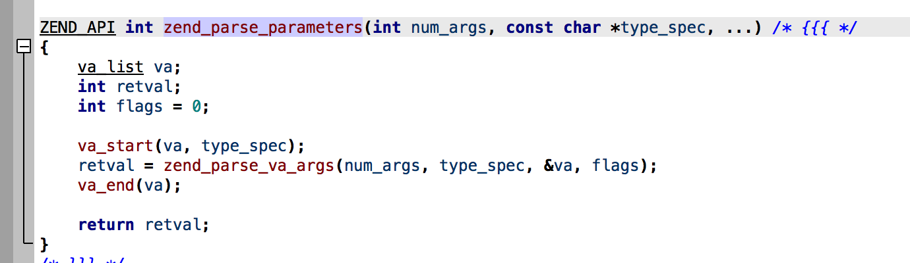

# zend_parse_parameters 介绍

## 背景
> 该函数是扩展入门的最重要的函数，估特意单独一节来介绍

## 参考
* [扩展中参数的解析](http://www.php-internals.com/book/?p=chapt11/11-02-01-zend-parse-parameters)

## 详细设计

### 函数
* 该函数定义在 zend_API.c 中。
* 

### 详解
* `ZEND_API int zend_parse_parameters(int num_args, const char *type_spec, ...)`
* 第一个参数是传递的参数个数，**通常使用 ZEND_NUM_ARGS() 来获取**
* 第二个参数是一个字符串，指定了函数期望的各个参数的类型，后面紧跟着需要随参数值更新的变量列表。
* 第二个参数的字符串，具体含义如下

| 类型指定符 | 对应的 C 类型 | 描述 |
| -------- | --------- | ---- | 
| l	| long | 符号整数 |
| d	| double | 浮点数 |
| s	| char *, int | 前者接收指针，后者接收长度，二进制字符串，长度 |
| b	| zend_bool | 逻辑型（1或0）|
| r	| zval * | 资源（文件指针，数据库连接等）|
| a	| zval * | 联合数组 |
| o	| zval * | 任何类型的对象 |
| O	| zval * | 指定类型的对象。需要提供目标对象的类类型 |
| z	| zval * | 无任何操作的zval |

Spec |	Type |	Locals
a |	array |	zval*
A |	array or object |	zval*
b |	boolean |	zend_bool
C |	class	 |zend_class_entry*
d |	double |	double
f |	function |	zend_fcall_info*, zend_fcall_info_cache*
h |	array |	HashTable*
H |	array or object |	HashTable*
l |	long |	long
L |	long (limits out-of-range LONG_MAX/LONG_MIN) |	long
o |	object |	zval*
O |	object (of specified zend_class_entry)	 |zval*, zend_class_entry*
p |	string (a valid path) |	char*, int
r |	resource |	zval*
s |	string |	char*, int
z |	mixed |	zval*
Z |	mixed |	zval**

### PHP_FUNCTION 展开

1. `#define PHP_FUNCTION			ZEND_FUNCTION`
2. `#define ZEND_FUNCTION(name)				ZEND_NAMED_FUNCTION(ZEND_FN(name))`
3. `#define ZEND_NAMED_FUNCTION(name)		void name(INTERNAL_FUNCTION_PARAMETERS)`
4. `#define ZEND_FN(name) zif_##name`
4. `#define INTERNAL_FUNCTION_PARAMETERS zend_execute_data *execute_data, zval *return_value`

* 由上推导出
> PHP_FUNCTION(hi) --> void zif_hi(zend_execute_data *execute_data, zval *return_value)
>
> zif: zend internal function

### （以上）