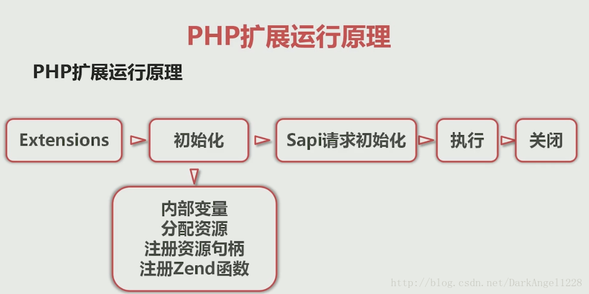
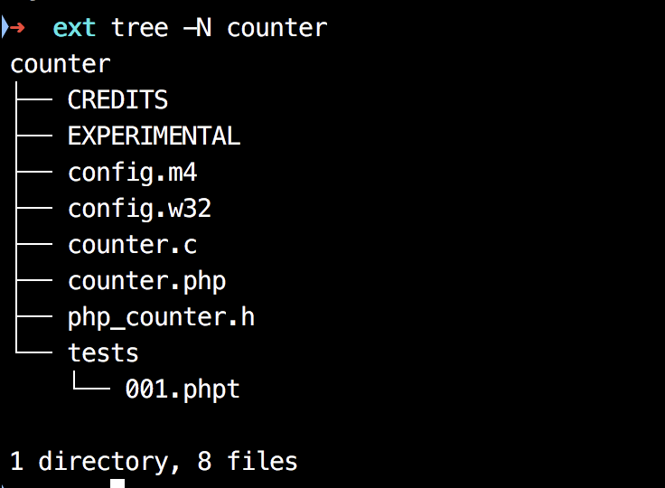

# php 扩展认识

## 引用
> https://segmentfault.com/a/1190000008114150
>
> 

## 参考

* [Zend 网站中的» Internals 章节](https://devzone.zend.com/303/extension-writing-part-i-introduction-to-php-and-zend/)
* [Zend API：深入 PHP 内核](http://php.net/manual/zh/internals2.ze1.zendapi.php)
* [TIPI 扩展入门](http://www.php-internals.com/book/?p=chapt11/11-02-00-extension-hello-world)

* [用 C/C++ 扩展你的 PHP](http://www.laruence.com/2009/04/28/719.html)
* [5 分钟 PHP 扩展开发快速入门](https://segmentfault.com/a/1190000008114150)
* [PHP 的 C/C++ 扩展（一）](https://www.jianshu.com/p/89a339978b03)
* [首次安装扩展](http://blog.beatzeus.com/2016/08/php%E6%89%A9%E5%B1%95%E5%BC%80%E5%8F%91/)
* [PHP 扩展-如何使用文件 config.m4](http://blog.beatzeus.com/2016/10/php%E6%89%A9%E5%B1%95-config-m4/)

## 先看图




## 前期准备

* 拷贝配置文件 `cp ~/learn/php-7.2.8/php.ini-development /Users/panlong/myphp728/lib/php.ini`
* 官方自带工具 `ext_skel` 的使用
* 找到 php ext 扩展安装目录
    * `~/myphp728/bin/php -i|grep ext` （我的在 `/Users/panlong/myphp728/lib/php/extensions/debug-non-zts-20170718`）
* 官方手册建议：当开发 PHP 扩展时，强烈建议安装 autoconf 2.13 版，尽管用更新的版本可使用。2.13 版被认为是在 autoconf 中可用性，适用性及用户基础等方面最好的版本。使用最新版本有时会与所期望的 configure 输出在样式上有所不同。

## php 安装后的目录结构

### PHP 安装目录 `tree -N -L 2 ~/myphp728`

```
├── bin     //PHP 编译生成的二进制程序目录
│   ├── php     //cli 模式下的 PHP
│   ├── php-cgi
│   ├── php-config  // 获取 PHP 的安装信息，编译安装 PHP 时会用到
│   ├── phpdbg
│   └── phpize  //生成扩展的 configure 文件
├── include     //PHP 源码的头文件 如下
│   └── php
├── lib         //依赖的 so 库
│   ├── php
│   └── php.ini
├── php
│   └── man
└── var     //日志
    ├── log
    └── run
```

### PHP 安装目录下的 include 目录 `tree -N -L 3 ~/myphp728/lib`

```
├── php
│   ├── build       //编译时的工具、m4 配置等，编写扩展时会用到
│   │   ├── Makefile.global
│   │   ├── acinclude.m4        //PHP 自定义的 autoconf 宏
│   │   ├── ax_check_compile_flag.m4
│   │   ├── config.guess
│   │   ├── config.sub
│   │   ├── libtool.m4          //libtool 定义的 autoconf 宏，acinclude.m4、libtool.m4 会被合成 aclocal.m4
│   │   ├── ltmain.sh
│   │   ├── mkdep.awk
│   │   ├── phpize.m4           //PHP 核心 configure.in 配置
│   │   ├── run-tests.php
│   │   ├── scan_makefile_in.awk
│   │   └── shtool
│   └── extensions  //扩展 so 保存目录
│       └── debug-non-zts-20170718
└── php.ini
```
## 执行命令

* PHP 源码/ext 目录下的工具 ext_skel 
    * `ls ~/learn/php-7.2.8/ext`
    * 作用：生成扩展的基本骨架，帮助扩展开发快速生成一个`规范`的扩展结构
    * 使用：./ext_skel --extname=扩展名称

* 多版本 PHP 需要注意
    * **php-config 是一个简单的命令行脚本用于获取所安装的 PHP 配置的信息。**
    * **在编译扩展时，如果安装有多个 PHP 版本，可以在配置时用 --with-php-config 选项来指定使用哪一个版本编译，该选项指定了相对应的 php-config 脚本的路径。**
  
* 扩展的安装步骤
    1. 通过 ext_skel 脚本生成扩展的基本框架
    2. 修改 config.m4 配置：设置编译配置参数、设置扩展的源文件、依赖库依赖函数检查等
    3. 编写扩展要实现的功能：按照 PHP 扩展的格式以及 PHP 提供的 API 编写功能
    4. 生成 configure：扩展编写完成后，执行 phpize 脚本生成 configure 以及其他配置文件
    5. 编译 & 安装：`编译三步`（./configure 、 make 、 make install） 然后将扩展的 `.so` 文件添加到 php.ini 中

* 生成扩展脚手架 
    * `这里为了方便说明，跟官网一样，也假设扩展叫 counter`
    * ./ext_skel --extname=counter
    * 执行后如图 
    * 现在我们查看脚手架搭建的代码 

## 扩展组成
 
* 从图中，我们看到以下必须文件
    * config.m4 
        * UNIX 构建系统交互文件，autoconf 规则的编译配置文件
        * config.m4 文件使用 GNU autoconf 语法编写。简而言之，就是用强大的宏语言增强的 shell 脚本。注释用字符串 dnl 分隔，字符串则放在左右方括号中间（例如，[ 和 ]）。字符串可按需要多次嵌套引用。完整的语法参考可参见位于 » http://www.gnu.org/software/autoconf/manual/ 的 autoconf 手册。
        * `此处点开参考文档简单了解下m4文件`  [参考文档](http://php.net/manual/zh/internals2.buildsys.configunix.php)
        * 按惯例，**PHP_ARG_WITH()** 用于取得参数的选项，例如扩展所需库或程序的位置；而 **PHP_ARG_ENABLE()**  用于代表简单标志的选项。
    * config.w32 Windows 构建系统配置
    * php_counter.h 扩展头文件
    * counter.c 扩展源文件
    * couter.php 用于在 PHP 中测试扩展是否可用，可以不用
    * tests 目录 测试用例，执行 make test 时将执行、验证这些用例
* 将 PHP_ARG_WITH 和下面的 --with-counter 前的注释去掉 （即dnl）
* 要能够被编译，还需要去掉 --enable-counter 前的注释
* 在源代码**根目录**执行 `./buildconf --force`
* 在源代码**根目录**执行 `./configure --help | grep counter`

## hook 函数
* 之前小课曾经说过 PHP 的生命周期 `module startup -> request startup -> exec -> request shutdown -> module shutdown`

## simple 例子

* 在 php_counter.h 里添加行 PHP_FUNCTION(hi);
* 在 counter.c 里添加

```
PHP_FUNCTION(hi) {
	php_printf("Hi world!");
}
```
## 扩展执行

* `~/myphp728/bin/phpize`
* `./configure --enable-counter --with-php-config=/Users/panlong/myphp728/bin/php-config`
* `make && make install`
* 将 `/Users/panlong/myphp728/lib/php/extensions/debug-non-zts-20170718/counter.so` 添加到 `php.ini` 中
    * 找到 ini 文件，添加 `extension=counter.so`
    * 验证：`~/myphp728/bin/php -m|grep counter`
    
## 测试结果

```
<?php
hi(); //输出：Hi world!

```


（以上）

